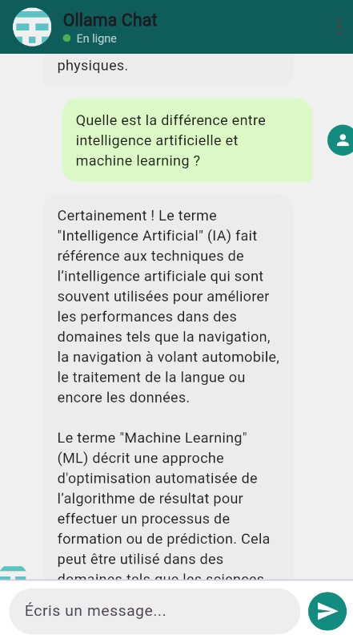

# 💬 Chat IA avec Ollama, Flutter et Flask

Ce projet est une application simple de messagerie entre un utilisateur et un modèle IA local (comme `llama3`, `phi3`, etc.) grâce à [Ollama](https://ollama.com), avec une interface moderne Flutter et un backend Flask.

## 🚀 Technologies utilisées

- 🧠 [Ollama](https://ollama.com) — serveur local de modèles LLM
- 🐍 Flask — backend Python
- 💙 Flutter — frontend mobile/web
- 🌐 API REST — communication via HTTP

##  Aperçu

 <!-- ajoute une image du chat si tu veux -->

## 📦 Installation

### 1. Lancer Ollama
ollama serve
ollama run tinyllama  # ou phi3, tinyllama...
